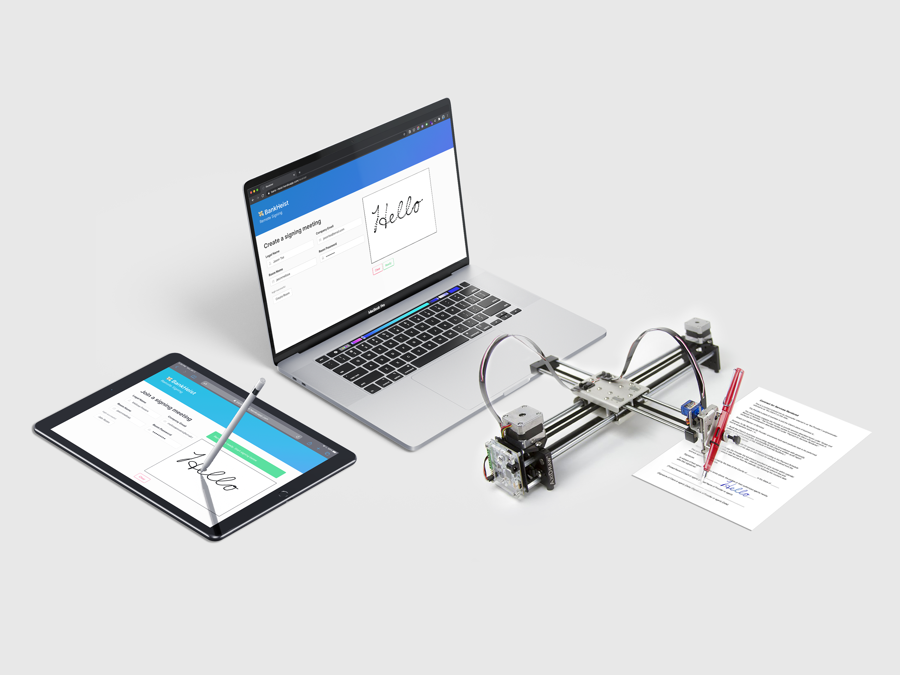
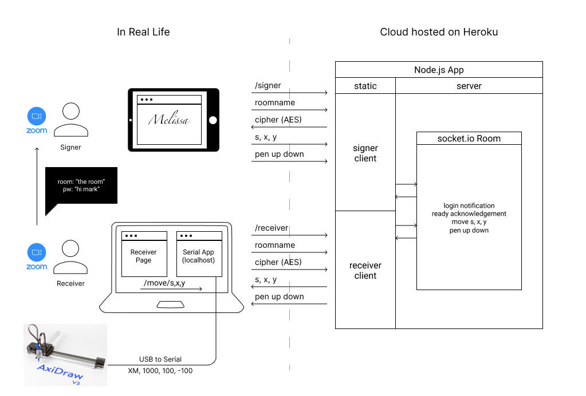
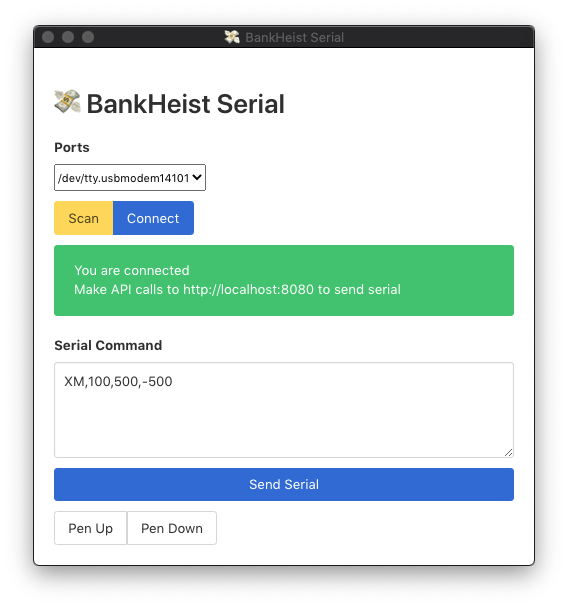
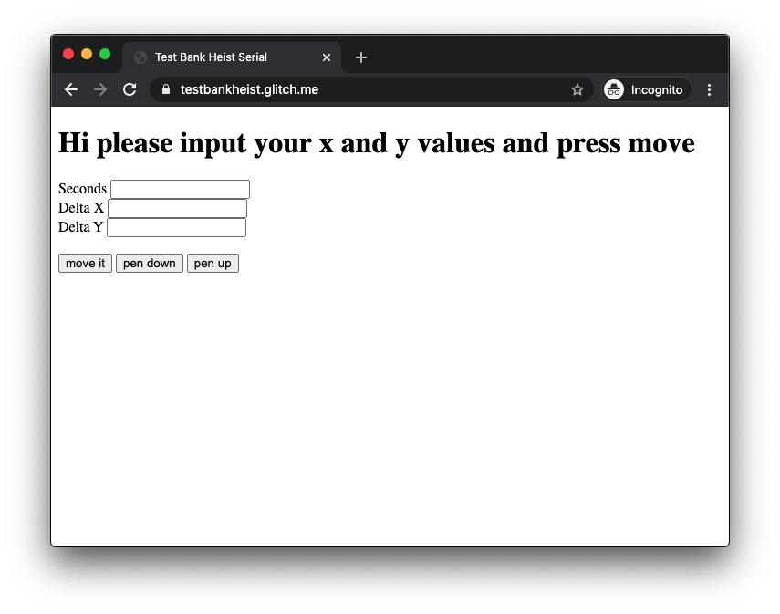

# 💸 BankHeist

> Pulling off a "Bank Heist" remotely by signing in real-time

Live on [Heroku](https://bank--heist.herokuapp.com/)!



Demo on [YouTube](http://www.youtube.com/watch?v=wwdG1mgFPkc)

[](http://www.youtube.com/watch?v=wwdG1mgFPkc "BankHeistYouTube")

Link to [Design Portfolio](https://jasontsemf.github.io/bankheist.html) for more information

Link to [Presentation Deck](https://docs.google.com/presentation/d/10jLiQrcMQCuyAEuc270NFHGXWnt4NvPkelLd_Dbk4I4/edit?usp=sharing)

## What is BankHeist?

BankHeist makes live remote singing possible. A receiver and a signer log into a secure environment over the internet to sign all sorts of documents remotely while communicating through a video chat application. The receiver obtain real-time signature data from the signer, then the computer sends moving commands to the Axidraw machine, to physically draw on a piece of paper.

## Why it exists

Imagine you are in a situation that requires you to sign a physical document overseas, possibly for banking or legal purposes, but your tight schedule or cost of travel restricts you from leaving your current location. Especially during a pandemic, it becomes impossible to travel abroad to finish such a task in a safe fashion.

## How it works

This is where BankHeist comes into play. By gathering the signer and the receiver in the same secure virtual signing room, utilizing `Socket.io` and `Crypto.js`, the digital signature/strokes on the signer end will be transferred to the receiver's end. Once the receiver's computer receives the signature data, it will be translated into serial commands which then drives the [AxiDraw](https://www.axidraw.com/) machine over a USB connection, with `SerialPort` enabled `Electron` app, to essentially turn the pixels into a physical signature on a piece of paper. When the signing session is being conducted, the receiver and signer will be connected with a video conference call (e.g. Zoom) to prove their physical presence during the entire signing process.



Not only it eliminates the physical distance restriction, but it also adds an extra layer of security to the entire signature process. It is far more secure than digital signature solutions available in the market, for instance, "DocuSign", where users can easily replicate a signature, or sign for another person if they have access to the signer's computer.

## Behind the Scene

### Get AxiDraw to work

Thank you [Tom Igoe](https://github.com/tigoe) for stopping us to build our own CNC drawing machine. Shout out to [Ben Moll](https://wp.nyu.edu/benjaminmoll/), for introducing me to the AxiDraw machine, and the [EBB Project](https://evil-mad.github.io/EggBot/ebb.html). And last but not least, [Ben Light](http://blightdesign.com/about_contact.html) for lending us the AxiDraw.

After reading Ben Moll's [blog](https://wp.nyu.edu/benjaminmoll/category/fall-2019/phys-comp/) and also the official documentation, I quickly figured out how the serial command works for the machine. The main command I used were:

``` bash
# XM — Stepper Move, for Mixed-axis Geometries
# XM, millis, x delta, y delta
XM,1000,550,-1234\r

# SP — Set Pen State
# 1 for pen down, 0 for pen up
SP,1\r
```

Utilizing the Arduino Serial Monitor, it was relatively straight forward to control the AxiDraw.

### Build New Serial App



It is such a shame that the `P5 SerialControl` app didn't work as intended. I would suspect that the reason why I am not able to get the AxiDraw to work with the `p5 SerialControl` is the `\r` carriage return is not being sent to the machine, and this is necessary for the machine to detect the command. So I gave up on the app, and decided to write my very own serial app.

I just happened to intuit that `SerialPort` and `Electron` can work in tandem for my serial app. The serial part of it was pretty straight forward. Making an `Electron` is a little more challenging as I have never had used a similar framework before. Once I figure out the right function to use, I found it relatively easy and convenient to make frontend and backend connection.

Once the serial functions is ready, `Express` is needed for setting up a localhost API for the static website hosted online to call.

``` js
// actual API calls
e.get("/move/:sxy", async (req, res) => {
  let temp = req.params.sxy.split(',');
  console.log(temp);
  s = temp[0];
  x = temp[1];
  y = temp[2];
  if (port) {
    let cmd = `XM,${s},${x},${y}\r`;
    mainWindow.webContents.send('cmdWrite', cmd);
    port.write(cmd, function (err) {
      if (err) {
        return console.log('Error on write: ', err.message)
      }
      console.log('message written', s, x, y);
    });
  }
  res.send("OK");
});
```

At the same time, I created a very simple static site on `glitch.com` for debuggging API calls.

[https://testbankheist.glitch.me/](https://testbankheist.glitch.me/)



``` js
let button = document.querySelector("#btn");
let x;
let y;
button.onclick = async () => {
    s = document.querySelector("#s").value;
    x = document.querySelector("#x").value;
    y = document.querySelector("#y").value;
    console.log(s, x, y);
    // let url = `http://localhost:8080/move`;
    let url = `http://localhost:8081/move/${s},${x},${y}`;
    let response = fetch(url, {
        mode: "cors"
    });
};
```

### Send coordinates locally with Socket.io

[Melissa Powers](https://github.com/mmp421) took her time to pick up `Socket.io` and `p5.js` with this excellent [tutorial](https://www.youtube.com/watch?v=bjULmG8fqc8) from the [Coding Train](https://www.youtube.com/user/shiffman). The logic of the tutorial became the foundation of our final signing logic.

### Send coordinates online

My choice of free online hosting is usually `Heroku`, as it is free and it has automagical integration with `GitHub`. It did took me a little while to establish and mash the `Express` and `Socket.io` instances into one single port `process.env.PORT` inorder to connect the app to `Heroku`'s default port. Before that, I had two different ports listening to `Express` and `Socket.io` separately, which was a mistake that I didn't recognize at the beginning.

``` js
const PORT = process.env.PORT || 8080;
const server = app.listen(PORT, () => console.log(`Server is listening on port ${PORT}...`));
const io = require('socket.io')(server, {
   cors: {
       origin: '*',
   }
});
```

### Map Sketch coordinates

However, the logic that we got form Shiffman's tutorial is not 100% compatible with our purpose, as we need the changes in coordinates to be sent to the AxiDraw instead of the actual XY coordinates. We implemented our own logic to track the framerate and also the deltas which suits our need for incorporating these values into the serial command of `XM,1000,550,-1234\r`.

``` js
function moveAxiDraw(data) {
  xarray.push(data.x);
  let findlastx = xarray[xarray.length - 2];
  xoutput.push(data.x - findlastx);

  yarray.push(data.y);
  let findlasty = yarray[yarray.length - 2];
  youtput.push(data.y - findlasty);
  console.log(data.s, xoutput[xoutput.length - 1], youtput[youtput.length - 1]);

  seconds.push(Math.floor(data.s));
  // steps on machine
  // x = 24700
  // y = 17500

  let writeS = seconds[seconds.length - 1];
  let writeX = xoutput[xoutput.length - 1] * factor;
  let writeY = youtput[youtput.length - 1] * factor;
  if (writeS < 500) {
    let url = `http://localhost:8081/move/${writeS},${writeX},${writeY}`;
    let response = fetch(url, {
      mode: 'no-cors'
    });
  }
}
```

### Crypto and Security

As recommended by the `Crypto.js` library, I am using AES as the encryption protocol. AES is The Advanced Encryption Standard (AES) is a U.S. Federal Information Processing Standard (FIPS). It was selected after a 5-year process where 15 competing designs were evaluated. It is essentially a symmetric encryption method, where the encryption side and the decryption side use the same key to en/decrypt the cipher.

As a secure environment is key to a signature's validity, it is worth taking the time to develop a login system and to encrypt data. And this is relatively the most lengthy part in the code.

The login handshake goes like this:

1. Receiver created room with the `roomname` and `key`
2. `Cipher` is created and sent to the server along with the `roomname`, no `key`/`password` is being sent through the internet, which is more secure
3. The receiver tell the signer the password verbally (ideally)
4. The signer enter the `roomname` and `key` to join the corresponding room
5. The `roomname` is being sent to the server to match the corresponding cipher
6. `Cipher` is sent to the signer
7. `Cipher` is being decrypted with the key the signer entered
8. If the encrypted message equals to `roomname`, allow the user to join the room 

``` js
io.on('connection', socket => {
    console.log(`${socket.id} has joined`);
    // receiver logic
    socket.on("receiver login", (data) => {
        console.log("a receiver");

        //users and room management
        const user = {
            fullname: data.fullname,
            email: data.email,
            id: socket.id
        };
        socket.nickname = user.fullname;
        const room = {
            room: data.roomname,
            cipher: data.cipher
        }
        // console.log(user);
        // console.log(rooms);
        users.push(user);
        rooms.push(room);

        // join room
        socket.join(room.room);
        io.in(room.room).emit('enter', `${user.fullname} has joined ${room.room}`);
        
        // ready to let the signer sign
        socket.on('receiver ready', (data) => { 
            console.log(`data is ${data}`);
            io.in(room.room).emit('receiver ready', true);
        });
    });

    // singer logic
    socket.on("signer login", (data) => {
        // console.log(data);
        // user management
        console.log("a signer");
        const user = {
            fullname: data.fullname,
            email: data.email,
            id: socket.id
        };
        socket.nickname = user.fullname;
        let room = {
            room: data.roomname
        }
        console.log(user);
        console.log(rooms);
        
        // login management
        let cipher;
        let targetRoomName;

        // find if the room the signer is looking for exists
        if (rooms.length > 0) {
            rooms.forEach(e => {
                if (e.room === room.room) {
                    targetRoomName = e.room;
                    cipher = e.cipher;
                    console.log("room exist");
                    // send cipher to the signer for decrypting
                    io.to(socket.id).emit("get cipher from server", cipher);
                } else {
                    console.log("room doesn't exist");
                    io.to(socket.id).emit('no room', true);
                }
            });
        } else {
            console.log("room, doesn't exist");
            io.to(socket.id).emit('no room', true);
        }

        // decryption success from the signer, allow signer to join the room
        socket.on("signer login success", logindata => {
            if (logindata.room === targetRoomName && logindata.cipher === cipher) {
                users.push(user);
                socket.join(targetRoomName);
                console.log(`${user.fullname} joined`);
                io.in(targetRoomName).emit('signer logged in', true);

                // forward mouse activity from signer to receiver
                socket.on('mousedown', (data) => {
                    console.log("pen down");
                    io.in(targetRoomName).emit('pendown', data);
                });
                socket.on('mouse', (data) => {
                    io.in(targetRoomName).emit('mouse', data);
                });
                socket.on('mouseup', (data) => {
                    console.log("pen up");
                    io.in(targetRoomName).emit('penup', data);
                });
            }
        });
    });
});

```

## Considering User Needs

### HUMAN ERROR

How to reset AxiDraw?

### ACCESSIBILITY

What if person cannot sign? How to authorize?

### LEGALITY

How can the person see the paperwork that is being signed when they don’t have it in front of them?

### ✨  VIBES (GENERALLY) ✨ 

How to make it feel less abrupt/impersonal than Zoom?

## Flow of Interaction

### Receiver

1. Prior, send document to signer to review
2. Create room (recording begins)
3. Log in with username and password, provide to signer
4. Agree that the document they placed on the AxiDraw is what they sent to signer
5. Confirm they accept signer’s signature (especially if someone is signing for them)
6. Line up paper to AxiDraw, so it is on the line 
7. Confirm verbally + on the site that they are ready for the signature 
8. Verify signature was accurate (or ask to redo) - all has to be indicated verbally and on the site

### Signer

1. Receive document from receiver to review
2. Receive room name and password via video chat
3. Enter the room
4. Agree that the document they placed on the AxiDraw is what they got from the receiver
5. Confirm they are signing of their own free will  (especially if someone is signing for them)
6. Confirm verbally + on the site that they are ready to draw
7. Draw
8. Verify signature was accurate (or clear and restart) - all has to be indicated verbally and on the site

### Future / Concerns/ Questions

Signature:

- Banks vs. Notaries vs. Other Legal Papers
- International differences
- How to account for minutiae?
- What kinds of pens?

Other Uses:

- Drawings (IRL livestream? It’s Twitch but, like, DeviantArt)
- Postcards
- (Love) Letters (🥺 )

- Frontend Design (CSS)
- More acknowledgement between users ⇒  UX
- Security rabbit hole! (I had an imaginary hacker version of me watching me coding, and exploiting my vulnerability)
- “Digital signature” (encrypt a completed signature with a key/ encrypt a file with a digital signature - could blockchain play a part?)

## Credits

This is a project in collaboration with [Melissa Powers](https://github.com/mmp421), for the ITP class "Understanding Networks" by [Tom Igoe](https://github.com/tigoe).
